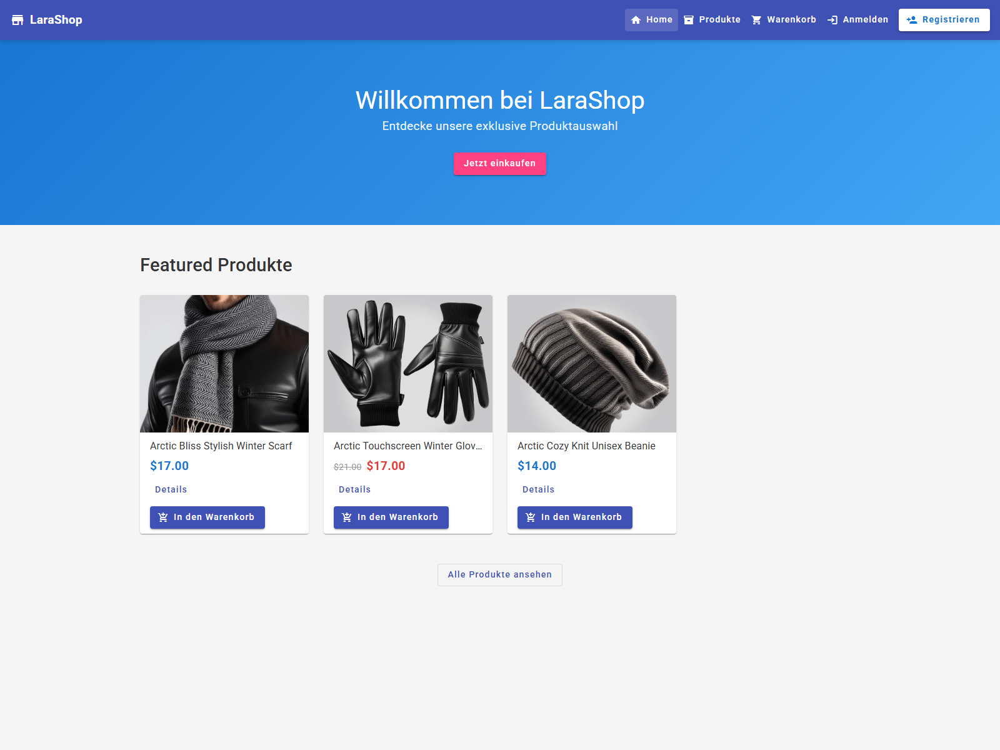
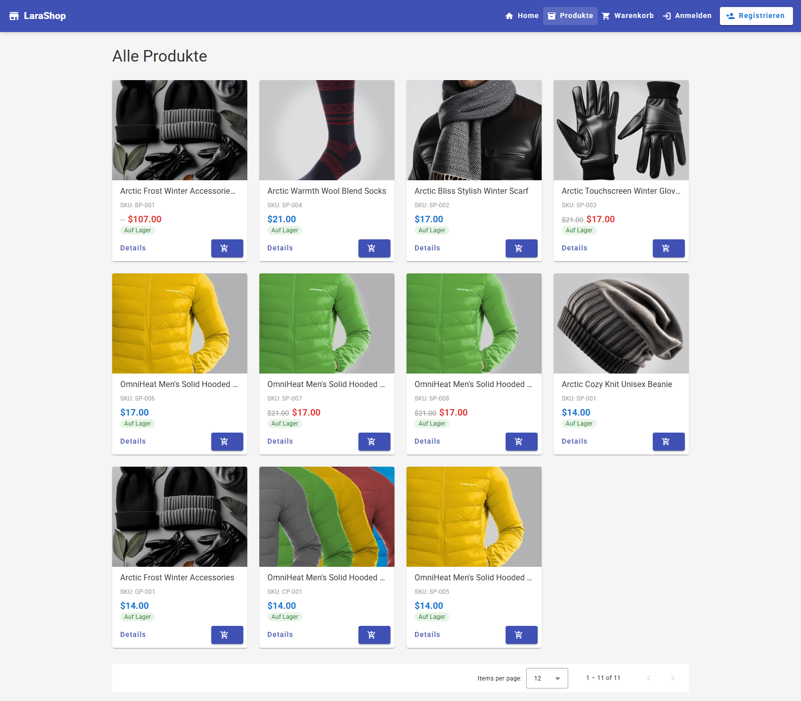
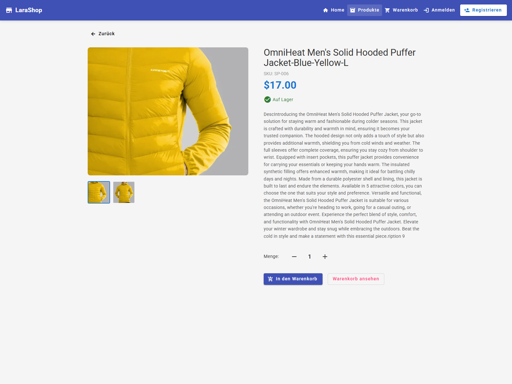

# LaraShop – End-to-End E-Commerce & DevOps Showcase

[](.github/workflows)
[](infra/terraform)
[](helm/angel-lara)

## Projektübersicht

**LaraShop** ist ein vollständiges E-Commerce-Projekt **plus** die komplette DevOps-Schicht
drumherum – in einem Monorepo. Es zeigt den Weg **von der laufenden Anwendung bis zum
reproduzierbaren Cloud-Deployment**:

- **App:** ein entkoppeltes **Angular-18-Frontend** (`angel/`), das ein **Bagisto/Laravel-Backend**
  (`lara/`) über dessen REST-API anspricht.
- **DevOps:** Docker, Terraform (AWS), Ansible (k3s), Helm, Observability-Stack und GitHub-Actions-CI.

Leitlinie überall: **sicher, kostenbewusst, reproduzierbar** – erst lokal lauffähig, Cloud nur bewusst.

---

## Architektur

```
                 User
                  │
        CloudFront (optional, CDN)
                  │
          Traefik Ingress (k3s)
                  │
        ┌─────────┴─────────┐
        │                   │
  Angular Frontend ──────►  Laravel/Bagisto Backend
   (Nginx, SPA)        REST   (PHP-FPM)
                              │
                       ┌──────┴──────┐
                     MySQL          Redis
                  (Daten)      (Cache/Queue)
```

**Telemetrie / Observability:**

```
   App / Services
        │  (OTLP)
 OpenTelemetry Collector
        │
   ┌────┼─────┐
Prometheus  Loki  Tempo
 (Metrics) (Logs)(Traces)
   └────┬─────┘
      Grafana   ◄── Alertmanager (Alarme)
   (Dashboards)
```

Eine ausführlichere Variante mit Erläuterungen: **[docs/architecture.md](docs/architecture.md)**.

---

## Tech Stack

| Technologie | Rolle im Projekt |
|---|---|
| **Angular 18** | Frontend (SPA, NgRx, Angular Material) |
| **Laravel 11** | Backend-Framework |
| **Bagisto** | E-Commerce-Plattform (auf Laravel) |
| **Docker** | Containerisierung von Frontend & Backend |
| **Docker Compose** | lokaler Multi-Service-Stack (App + Observability) |
| **Terraform** | Infrastructure as Code (AWS) |
| **AWS** | Ziel-Cloud (EC2, optional RDS/S3/CloudFront) |
| **Ansible** | Server-Provisioning (k3s, Docker, Helm) |
| **k3s** | leichtgewichtiges Kubernetes |
| **Helm** | Kubernetes-Paketierung/-Deployment |
| **GitHub Actions** | CI (Lint, Build, Validate) |
| **Prometheus** | Metriken |
| **Grafana** | Dashboards/Visualisierung |
| **Loki** | Log-Aggregation |
| **Tempo** | Distributed Tracing |
| **OpenTelemetry** | zentraler Telemetrie-Eingang (OTLP) |
| **Alertmanager** | Alarm-Routing |
| **KEDA** | ereignisbasiertes Autoscaling (Prometheus-Scaler) |

---

## DevOps Features

- 🐳 **Containerisierung** beider Apps (Multi-Stage-Dockerfiles, schlanke Runtime-Images).
- 🧩 **Lokaler Stack** via Docker Compose: Frontend, Backend, MySQL, Redis.
- 🏗️ **Terraform-Module**: Netzwerk (VPC/Subnetze/Routing) und Compute (EC2 für k3s) –
  modular, getoggelt, kostenkontrolliert.
- 🔧 **Ansible-Rollen**: `common`, `docker`, `k3s`, `helm`, `security` (UFW).
- ☸️ **Helm-Chart** für k3s: Frontend, Backend, Worker, Scheduler (CronJob), Migration-Job
  (Helm-Hook), Ingress, HPA, KEDA, ConfigMap/Secret.
- 📈 **Observability-Stack**: Prometheus, Grafana, Loki, Tempo, OpenTelemetry Collector, Alertmanager.
- 🤖 **CI** (GitHub Actions): Angular-Build, Laravel-Checks, `terraform validate`, `helm lint`,
  `docker build` – **ohne** Deploy/Push.
- 🛟 **Helfer-Skripte**: `setup-local`, `deploy`, `destroy`, `health-check` – mit Sicherheitsschranken.

---

## Projektstruktur

```
ki-odner/
├── angel/             # Angular-18-Frontend (Storefront "LaraShop")
├── lara/              # Bagisto/Laravel-Backend (REST-API + Admin)
├── infra/terraform/   # Infrastructure as Code (AWS) + Module (network, compute)
├── ansible/           # Provisioning zu einem k3s-Node (Rollen + Playbooks)
├── helm/angel-lara/   # Helm-Chart für das Kubernetes-Deployment
├── observability/     # Prometheus, Grafana, Loki, Tempo, OTel, Alertmanager (Compose)
├── scripts/           # setup-local / deploy / destroy / health-check
├── .github/workflows/ # CI-Pipelines (ci, terraform, docker)
└── docs/              # Architektur, Docker- & Deployment-Doku, Screenshots
```

---

## Quickstart (lokal)

> Voraussetzungen: Docker + Docker Compose. Für die App-Entwicklung zusätzlich Node 20 & PHP 8.2.

**Windows (PowerShell):**
```powershell
scripts/setup-local.ps1 -Build -Observability
```

**Linux / macOS / Git Bash:**
```bash
BUILD=true OBSERVABILITY=true ./scripts/setup-local.sh
```

**Health-Check:**
```bash
./scripts/health-check.sh
```

**Stoppen / Aufräumen:**
```bash
./scripts/destroy.sh
```

Erreichbar: Frontend `:8080`, Backend `:8000`, Grafana `:3000`, Prometheus `:9090`.
Details zum Container-Setup: **[docs/docker.md](docs/docker.md)**.

<details>
<summary>App direkt (ohne Docker) starten</summary>

**Backend (`lara/`):**
```bash
cd lara
composer install
cp .env.example .env        # DB-Zugang eintragen (DB_HOST/DB_DATABASE/DB_USERNAME/DB_PASSWORD)
php artisan key:generate
php artisan bagisto:install  # bei Beispielprodukten 'true' wählen → gefüllter Demo-Shop
npm install && npm run build
php artisan serve            # http://localhost:8000  (Admin: /admin)
```

**Frontend (`angel/`):**
```bash
cd angel
npm install --legacy-peer-deps   # NgRx ^21 vs. Angular 18 -> legacy peer deps
npm start                        # http://localhost:4200
```

**Demo-Daten nachträglich seeden:**
```bash
cd lara
php artisan tinker --execute="app(\Webkul\Installer\Helpers\DatabaseManager::class)->seedSampleProducts(['default_locale'=>'en','allowed_locales'=>['en'],'default_currency'=>'USD','allowed_currencies'=>['USD']]);"
php artisan indexer:index --mode=full
```
</details>

---

## Screenshots

| Startseite | Produktübersicht | Produktdetail |
|---|---|---|
|  |  |  |

---

## CI/CD

GitHub Actions unter `.github/workflows/` (Details: **[.github/workflows/README.md](.github/workflows/README.md)**):

- **`ci.yml`** – Angular (`npm ci`/`build`), Laravel (`composer install`, `php -l`, `artisan --version`), Helm (`lint` + `template`).
- **`terraform.yml`** – `fmt -check`, `init -backend=false`, `validate` (nur bei `infra/terraform/**`).
- **`docker.yml`** – `docker build` für beide Images (**`push: false`**).

**Bewusst:** CI **prüft nur** – kein Deploy, kein `terraform apply`, kein `docker push`, keine Secrets
(`permissions: contents: read`). Ein echter Deploy-Workflow wäre separat, manuell (`workflow_dispatch`)
und mit AWS-**OIDC** statt langlebiger Keys.

---

## Observability

Lokaler Stack in `observability/` (Start: `docker compose -f observability/docker-compose.observability.yml up -d`):

- **OpenTelemetry Collector** – zentraler OTLP-Eingang (gRPC 4317 / HTTP 4318), verteilt Telemetrie.
- **Prometheus** (`:9090`) – Metriken + Alert-Regeln.
- **Loki** (`:3100`) – zentrale Logs.
- **Tempo** (`:3200`) – verteilte Traces.
- **Grafana** (`:3000`) – Dashboards (Datasources + Dashboards auto-provisioniert).
- **Alertmanager** (`:9093`) – Alarm-Routing (Demo, ohne echte Webhooks).

Anbindung der App über OTLP bzw. einen `/metrics`-Scrape-Target; im Cluster kann **KEDA** gegen
Prometheus skalieren.

---

## Infrastruktur

- **Terraform** (`infra/terraform/`) – Provider/Variablen/Outputs + zwei Module:
  - **network** – VPC, je 2 öffentliche/private Subnetze, IGW, Route Tables, optionales NAT Gateway.
  - **compute** – kleine **EC2** (Ubuntu, `t3.micro`) + Security Group (SSH/HTTP/HTTPS, k8s-API 6443
    nicht öffentlich) + Key Pair – **nur** bei `enable_compute=true`.
- **Ansible** (`ansible/`) – provisioniert die EC2 zu einem **k3s-Node** (Docker, k3s, Helm, UFW).
- **Helm** (`helm/angel-lara/`) – deployt die Container-Images auf k3s (inkl. Worker/Scheduler/Ingress/HPA/KEDA).
- **AWS-Deployment** Schritt für Schritt: **[DEPLOYMENT.md](DEPLOYMENT.md)** (mit Kosten-/Free-Tier-Hinweisen).

---

## Sicherheit

- 🔒 **Keine Secrets im Repository** – `.env`, Keys, `*.tfvars`, `inventory.ini` sind gitignored;
  Helm-Secret/ConfigMap enthalten nur Platzhalter, kein echter `APP_KEY`.
- 💶 **Terraform kostenkontrolliert** – alle kostenträchtigen Toggles (`enable_compute`, `enable_rds`,
  `enable_nat_gateway`, …) standardmäßig `false`; nur kleine Instanzen.
- 🚦 **Deployments nur mit expliziter Bestätigung** – `deploy.sh` deployt erst bei `CONFIRM_DEPLOY=yes`;
  CI deployt nie automatisch.
- 🛑 **Destroy-Schutz** – `destroy.sh` macht standardmäßig nur lokalen Cleanup; `terraform destroy`
  erfordert `CONFIRM_TERRAFORM_DESTROY=yes` **und** ein zusätzlich eingetipptes `DESTROY`.
- 🌐 **Netzwerk** – private Subnetze ohne öffentliche IP; Kubernetes-API (6443) nicht öffentlich.

---

## Bewerbungsrelevante Skills

| Skill | Im Projekt nachweisbar durch |
|---|---|
| **Docker** | Multi-Stage-Dockerfiles (Angular/Nginx, PHP-FPM/Nginx), Compose-Stack |
| **Kubernetes** | k3s-Zielplattform, Deployments/Services/CronJob/Ingress |
| **Helm** | vollständiges Chart mit Hooks, HPA, KEDA, ConfigMap/Secret |
| **Terraform** | modulare IaC (network/compute), Toggles, `fmt/validate` in CI |
| **AWS** | EC2/VPC-Design, Deployment-Guide, RDS/S3/CloudFront vorbereitet |
| **Ansible** | Rollenbasiertes Provisioning eines k3s-Nodes |
| **GitHub Actions** | CI für App, IaC, Container, Helm |
| **Observability** | Prometheus/Grafana/Loki/Tempo/OTel/Alertmanager |
| **CI/CD** | automatisierte Qualitätsprüfung, sichere Deploy-Strategie |
| **Infrastructure as Code** | gesamte Infra versioniert, reproduzierbar, reviewbar |

---

## Bekannte Hinweise

- **NgRx-Versionen:** `@ngrx/*` sind in `angel/package.json` auf `^21` gepinnt, das Projekt läuft auf
  Angular 18 → Install mit `--legacy-peer-deps`. Sauber: NgRx auf 18.x angleichen.
- **Produktbilder:** Uploads liegen in `lara/storage/app/public/` und sind (Laravel-üblich) nicht im
  Repo. Frische Installation zeigt Platzhalter, bis Beispielprodukte geseedet werden.
- **`.env` / Build-Artefakte:** `.env` und `lara/public/build/*` sind gitignored und gehören nicht ins Repo.

---

> Hinweis: Dies ist ein **Demo-/Portfolioprojekt**. Es ist für die **lokale Ausführung** und eine
> **kurze, bewusste** AWS-Demo gedacht – nicht als dauerhaft öffentlich betriebener Produktionsshop.
