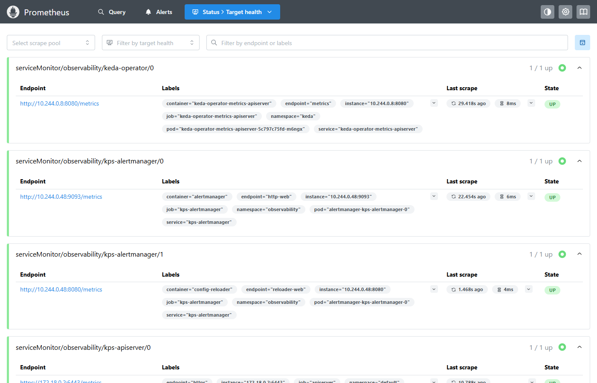
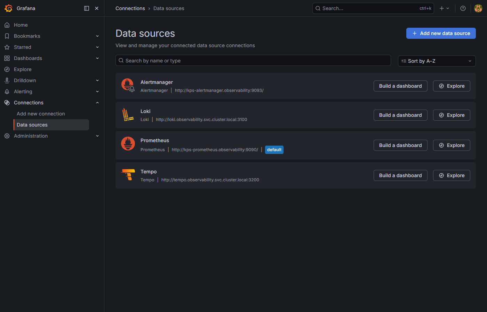
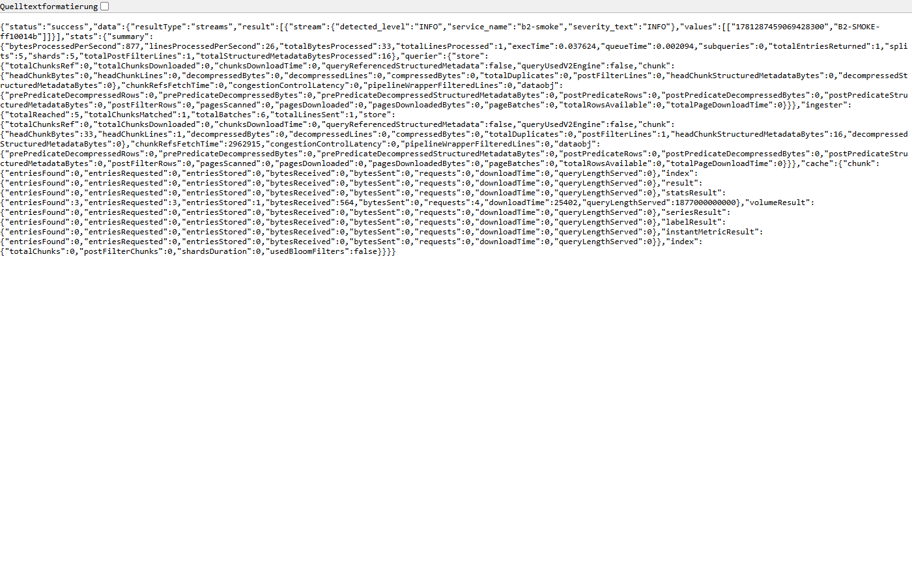
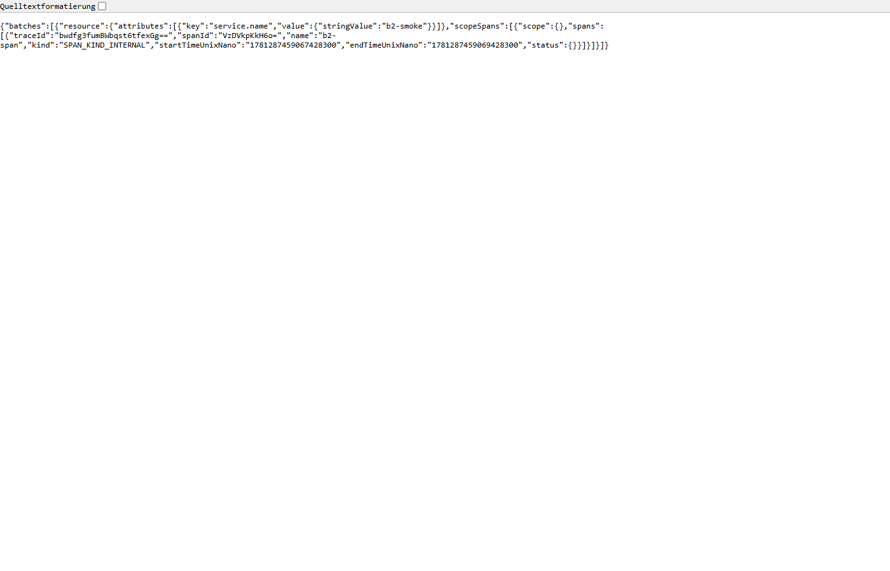

# Observability in Kubernetes – Nachweis (lokal, kind)

**Datum:** 2026-06-12
**Umgebung:** lokaler **kind**-Cluster `angel-lara`, Namespace **`observability`** – rein **lokal, keine Cloud, keine Kosten.**
**Quelle:** [`observability/k8s/`](../observability/k8s/) (Helm-Values + ServiceMonitor + README)

Ziel: nachweisen, dass der komplette Observability-Stack **im Cluster** läuft und die Komponenten **miteinander verbunden** sind (Prometheus scrapt OTel/KEDA, Grafana mit allen Datenquellen, OTLP-Pipeline → Tempo/Loki).

---

## Deployte Releases (`helm list -n observability`)

| Release | Chart | Komponenten |
|---|---|---|
| `kps` | kube-prometheus-stack-86.2.2 | Prometheus, Grafana, Alertmanager, kube-state-metrics, node-exporter, Operator |
| `loki` | loki-7.0.0 | Loki (SingleBinary) |
| `tempo` | tempo-1.24.4 (Image **2.3.1** gepinnt) | Tempo (SingleBinary) |
| `otel-collector` | **opentelemetry-collector-0.85.0** (App 0.96.0 gepinnt) | OTLP-Gateway |

→ **9/9 Pods Running** in `observability`.

---

## Prüfergebnisse

### 1. Prometheus
- **19 Targets, 15 up.**
- ✅ `otel-collector` (8888/metrics) → **up**
- ✅ `kube-state-metrics` → **up**
- ✅ **KEDA-Metriken**: ServiceMonitor `observability/keda-operator` → **up** (`keda_internal_metricsservice_*` abfragbar); zusätzlich ist die **KEDA-verwaltete HPA** über kube-state-metrics sichtbar (`kube_horizontalpodautoscaler_*{horizontalpodautoscaler="keda-hpa-angel-lara-worker"}`).
- ℹ️ `down`: `kube-controller-manager`, `kube-etcd`, `kube-proxy`, `kube-scheduler` – **bekannte kind-Einschränkung** (Control-Plane bindet auf 127.0.0.1, nicht scrapebar). In k3s/Cloud sind diese erreichbar.

Screenshot: 

### 2. Grafana – Datenquellen (automatisch provisioniert)
- ✅ **Prometheus** (default), **Loki** (`http://loki.observability.svc:3100`), **Tempo** (`http://tempo.observability.svc:3200`), Alertmanager.

Screenshot: 

### 3. Loki
- ✅ `GET /ready` = **200**
- ✅ **Test-Log** über die OTLP-Pipeline erzeugt und in Loki wiedergefunden (Marker `B2-SMOKE-…`, Stream `service_name="b2-smoke"`).

Screenshot (Loki-Query-Ergebnis): 

### 4. Tempo
- ✅ `GET /ready` = **200**
- ✅ **Test-Trace** über die OTLP-Pipeline erzeugt und in Tempo wiedergefunden (Span `b2-span`, `service.name="b2-smoke"`).

Screenshot (Tempo-Trace): 

### 5. OpenTelemetry Collector
- ✅ **OTLP-HTTP** `POST /v1/traces` = **200**, `POST /v1/logs` = **200**.
- ✅ **OTLP-gRPC** `:4317`: Collector-Log „Starting GRPC server … endpoint 0.0.0.0:4317" + „Everything is ready".
- ✅ **Export-Pipeline verifiziert:** OTLP → Collector → **Tempo** (Traces) und → **Loki** (Logs) – Test-Trace und Test-Log sind nachweislich angekommen (siehe 3./4.).

---

## Während der Installation behoben

1. **Loki** CrashLoop `mkdir /var/loki: read-only fs` → beschreibbares **emptyDir** an `/var/loki` (`singleBinary.extraVolumes/Mounts`).
2. **Tempo** CrashLoop `mkdir /var/tempo: permission denied` → emptyDir + Mount unter **`tempo.extraVolumeMounts`** (asymmetrische Chart-Struktur) + einmaliges Pod-Delete (StatefulSet-`OrderedReady`-Deadlock).
3. **OTel** CrashLoop `service.telemetry.metrics.readers … with_resource_constant_labels` → **Chart-Version `0.85.0`** passend zur 0.96.0-Binary gepinnt.
4. **KEDA-Metriken**: ServiceMonitor (`servicemonitor-keda.yaml`) für `keda-operator-metrics-apiserver:8080` ergänzt.

---

## Hinweise / Bekannte Einschränkungen

- **Lokal, keine Kosten.** Alles emptyDir (Wegwerf-Demo); Daten nach Pod-Neustart weg.
- **Versions-Pinning:** Tempo `2.3.1`, OTel-Collector contrib `0.96.0` (Chart `0.85.0`).
- **Loki/Tempo-Nachweis-Screenshots** zeigen die **rohen API-Antworten** (Query-Ergebnis mit Marker bzw. Trace). Grund: Grafana **Explore** ist über `kubectl port-forward` asset-lastig instabil (Monaco-Editor) – die Datenquellen-Anbindung selbst ist im Datasources-Screenshot belegt.
- **Grafana-Admin-Passwort** wird nur zur Laufzeit per `--set` gesetzt (kein Secret im Repo).
- **App-Telemetrie** (echte Traces/Metriken aus Angular/Laravel) ist optional und Teil eines späteren Schritts (App-Instrumentierung).
