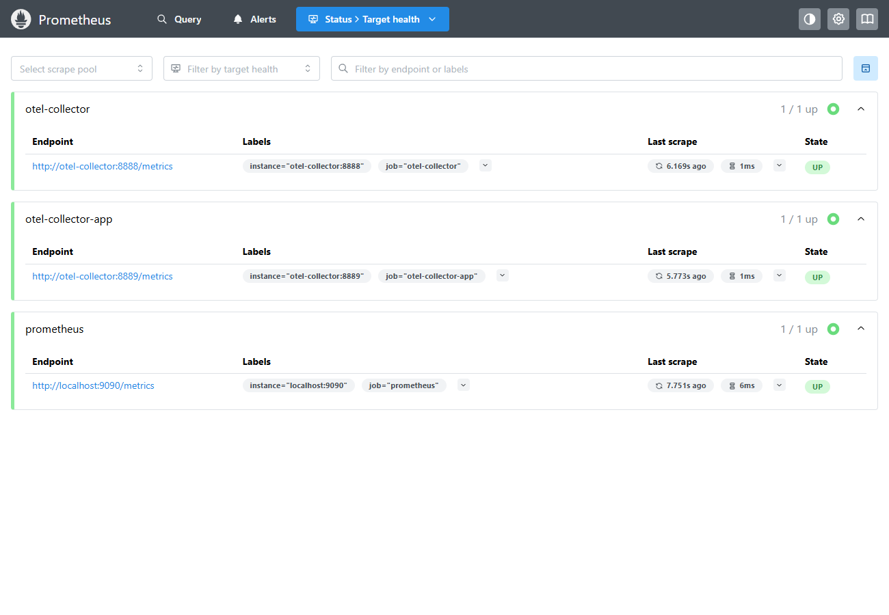
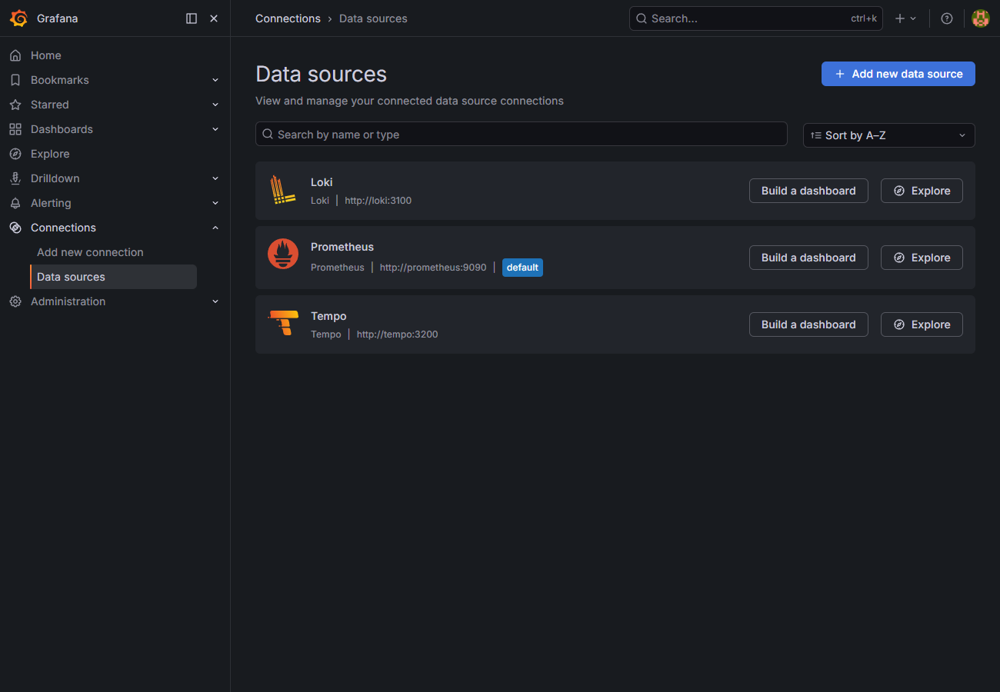

# Observability-Stack – Lokaler Nachweis

**Datum:** 2026-06-12
**Umgebung:** rein lokal (Docker Compose, Docker Engine 29.4.1) – **keine Cloud, keine AWS-Ressourcen, keine Kosten.**
**Compose-Datei:** [`observability/docker-compose.observability.yml`](../observability/docker-compose.observability.yml)

Ziel: nachweisen, dass der Observability-Stack aus dem Repo lokal startet und die Komponenten erreichbar sind sowie korrekt zusammenspielen (Prometheus scrapt den OpenTelemetry Collector, Grafana ist mit allen Datenquellen provisioniert).

---

## Gestartete Services

```
docker compose -f observability/docker-compose.observability.yml up -d
```

| Service | Image | Status |
|---|---|---|
| Prometheus | `prom/prometheus:latest` | Up |
| Alertmanager | `prom/alertmanager:latest` | Up |
| Grafana | `grafana/grafana:latest` | Up |
| Loki | `grafana/loki:latest` | Up |
| Tempo | `grafana/tempo:2.3.1` *(siehe Einschränkungen)* | Up |
| OpenTelemetry Collector | `otel/opentelemetry-collector-contrib:0.96.0` *(siehe Einschränkungen)* | Up |

→ **6 / 6 Container laufen.**

---

## Lokale URLs

| Komponente | URL | Health-Endpoint |
|---|---|---|
| Prometheus | http://localhost:9090 | `/-/healthy` |
| Alertmanager | http://localhost:9093 | `/-/healthy` |
| Grafana | http://localhost:3000 | `/api/health` (Login `admin` / `admin`, nur lokal) |
| Loki | http://localhost:3100 | `/ready` |
| Tempo | http://localhost:3200 | `/ready` |
| OTel Collector (OTLP) | gRPC `:4317` / HTTP `:4318` | OTLP `POST /v1/traces` |

---

## Prüfergebnisse

### Endpunkte (HTTP-Statuscodes)

| Prüfung | Ergebnis |
|---|---|
| Prometheus `GET /-/healthy` | **200** ✅ |
| Alertmanager `GET /-/healthy` | **200** ✅ |
| Grafana `GET /api/health` | **200** ✅ |
| Loki `GET /ready` | **200** ✅ |
| Tempo `GET /ready` | **200** ✅ *(kurz nach Start zunächst 503 während Ingester-Warmup, danach 200)* |
| OTel Collector `POST /v1/traces` (OTLP-HTTP) | **200** ✅ |

### Prometheus Targets

```
job=otel-collector       http://otel-collector:8888/metrics  -> up
job=otel-collector-app   http://otel-collector:8889/metrics  -> up
job=prometheus           http://localhost:9090/metrics       -> up
```
→ **3 / 3 Targets UP** (Prometheus scrapt sich selbst und den OpenTelemetry Collector).

### Grafana Datenquellen (provisioniert)

Automatisch über `observability/grafana/provisioning` eingerichtet:
- **Prometheus** → `http://prometheus:9090` (default)
- **Loki** → `http://loki:3100`
- **Tempo** → `http://tempo:3200`

### Visuelle Nachweise

- Prometheus Target health: 
- Grafana Datenquellen: 

---

## Hinweis: lokal, keine Cloud-Kosten

Dieser Nachweis wurde vollständig **lokal** mit Docker Compose erbracht. Es wurden **keine** AWS-/Cloud-Ressourcen erzeugt, kein `terraform apply` ausgeführt und somit **keine Kosten** verursacht. Der Stack wurde nach dem Nachweis wieder gestoppt.

---

## Bekannte Einschränkungen

1. **Versions-Drift bei `:latest` (behoben).** Mit `:latest` brachen **Tempo** und **OpenTelemetry Collector** beim Start ab, weil aktuelle Upstream-Versionen das Config-Schema geändert haben:
   - Tempo (latest): `field ingester / compactor not found in type app.Config`
   - OTel Collector (latest): `service.telemetry.metrics` → Schlüssel `address` entfernt
   **Fix:** Im Compose sind diese beiden Images jetzt auf zu den Configs passende, getestete Versionen gepinnt (`grafana/tempo:2.3.1`, `otel/opentelemetry-collector-contrib:0.96.0`) – für Reproduzierbarkeit. Die übrigen Images stehen weiterhin auf `:latest` und könnten künftig analog gepinnt werden.
2. **Tempo Readiness.** `GET /ready` liefert direkt nach dem Start kurzzeitig `503`, bis der Ingester bereit ist – danach `200`.
3. **Noch keine App-Telemetrie.** Der Collector empfängt OTLP und exportiert nach Tempo/Prometheus/Loki, es sendet jedoch noch keine Anwendung produktiv Traces/Metriken. Der Scrape-Target `otel-collector-app:8889` ist `up`, liefert aber erst Daten, sobald eine instrumentierte App Telemetrie schickt.
4. **Grafana-Demo-Zugang.** `admin` / `admin` ist ausschließlich für den lokalen Nachweis gedacht – niemals so in produktiven Umgebungen verwenden.
